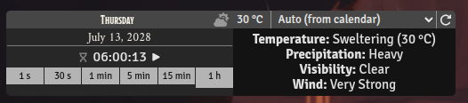
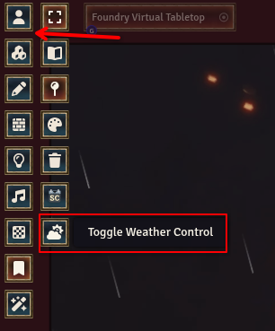
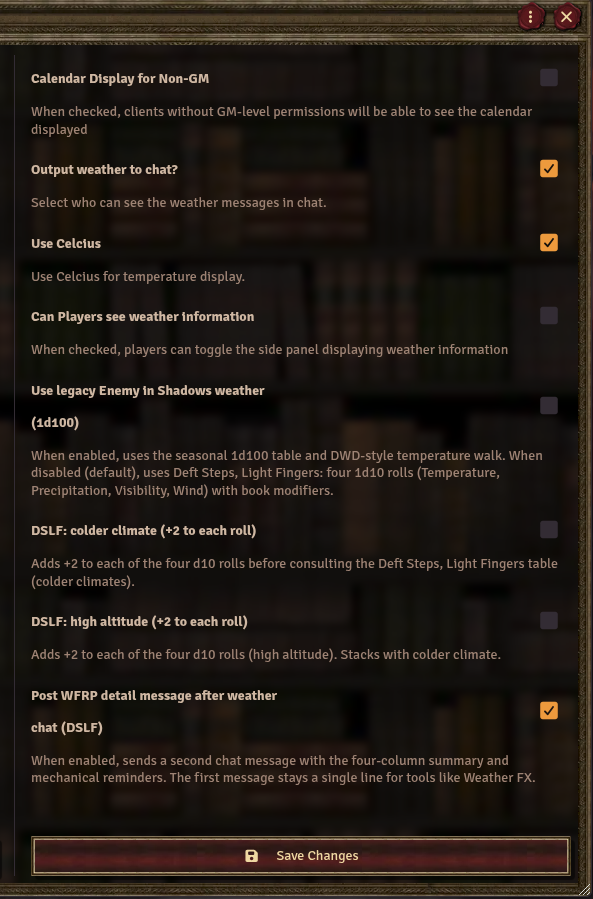
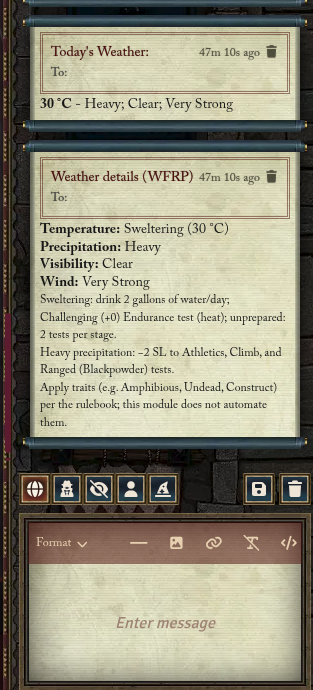

# Weather Control

Add **dynamic, calendar-driven weather** to your Foundry VTT world. Weather Control integrates with **Simple Calendar** (original or Reborn) **or** **[Seasons & Stars](https://github.com/rayners/fvtt-seasons-and-stars)** for the current date and season, then generates daily weather using the **Deft Steps, Light Fingers** rules (WFRP): **four separate 1d10 rolls** (Temperature, Precipitation, Visibility, Wind) with **seasonal modifiers** and optional **environmental** modifiers. The **weather panel** shows the four-column summary; **chat** uses the same **legacy-style** line as before DSLF (**bold temperature** + short **one-line** description) so tools like **WeatherFX** can parse messages. **Foundry scene weather** (rain, snow, clouds) is applied by this module via the canvas layer. **FXMaster** remains optional for extra scene effects if you use it.

**Intended for WFRP4e:** This fork is aimed at **Warhammer Fantasy Roleplay 4th Edition** tables and workflows (DSLF default; optional legacy Enemy in Shadows). Other systems can use the module for generic weather, but the **labels and mechanical notes** follow WFRP references.

**Legacy mode:** In module settings you can enable **“Use legacy Enemy in Shadows weather (1d100)”** to restore the **Enemy in Shadows Companion** style **seasonal 1d100** table plus **German DWD–style** seasonal temperature profiles (°F random walk).

---

## Weather rules at a glance

| Topic | **DSLF (default)** | **Enemy in Shadows — legacy (optional)** |
|--------|----------------------|------------------------------------------|
| **Source book** | *Deft Steps, Light Fingers* (WFRP) | *Enemy in Shadows Companion* + original **`generate`** weather logic |
| **Dice** | Four **1d10** rolls with shared modifiers | **1d100** seasonal → category → internal roll → **`PrecipitationGenerator.generate`**; **1d20** fallback if season cannot be resolved |
| **Temperature** | Column band + **°F** display value, clamped to season range | DWD **random walk** in **°F** (min/max per season) |
| **Conditions** | Four columns (Temp, Precip, Visibility, Wind) | Category → internal roll → localized strings + canvas effects |
| **Chat** | First line + optional WFRP detail card | **Single** message via **`output()`**: bold temperature + one precipitation string |
| **Weather panel** | Full **DSLF** four-line HTML | Legacy description + temperature HTML |

See [DSLF (default)](#weather-generation-scene-effects-and-chat-dslf--default) and [legacy](#legacy-enemy-in-shadows-optional-setting) for full rules.

---

## Features

- **Calendar integration**: Uses [Simple Calendar](https://github.com/vigoren/foundryvtt-simple-calendar), [Simple Calendar Reborn](https://github.com/Fireblight-Studios/foundryvtt-simple-calendar), or [Seasons & Stars](https://github.com/rayners/fvtt-seasons-and-stars) for the current date and season (**one of these is required**; not a hard Foundry `requires` dependency). Weather updates when the calendar date or time changes (e.g. when the GM advances time). If none is enabled, the module warns on world load.
- **Season selector**: Choose **Auto** (follow the active calendar’s current season) or fix **Spring**, **Summer**, **Autumn**, or **Winter** for weather generation. The selection is saved across sessions.
- **Deft Steps, Light Fingers (default)**: Roll **1d10** separately for each column; apply modifiers **per roll**: Summer +0; Spring +2; Autumn +2; Winter +4; optional **+2** for **colder climate** and **+2** for **high altitude** (world settings). Results map to the book’s four columns (e.g. Sweltering → Bitter, None → Very Heavy precipitation, Clear → Thick Fog, Still → Very Strong wind). Representative **°F** values drive rain/snow on the canvas.
- **Reference strings**: Optional **`wctrl.dslf.mechanical.*`** entries in `lang/*.json` are for reference only; they are **not** posted to chat. Apply traits and tests per your rulebook.
- **Legacy Enemy in Shadows weather** (optional): Seasonal **1d100** → category (Dry, Fair, Rain, …) and DWD-style **temperature** random walk in °F.
- **Output to chat**: Option to send the day’s weather to chat, with configurable visibility (e.g. GM only, all players).
- **Player visibility**: Option to let players see the weather panel without being able to change season or regenerate weather.
- **Scene weather**: Foundry canvas weather layer (`WeatherEffects`); optional **FXMaster** if you use it elsewhere.
- **Multi-language**: UI and messages support English, Français, Deutsch, Español, Polski, Português (Brasil), 日本語, 简体中文, and Korean. **DSLF** column labels and optional **mechanical** reference strings in `lang/*.json` are maintained for **English** first; other languages can be extended.

See **[CHANGELOG.md](./CHANGELOG.md)** for version history.

---

## Screenshots

All images are in [`assets/`](./assets/).

### Module in Foundry

### Screen location (weather panel)

### Module settings

### Output to chat

---

## Dependencies

| Dependency | Type | Notes |
|------------|------|--------|
| **Foundry VTT** | Core | Minimum 13; verified on 14 |
| **Calendar** (one of) | Required for proper operation (soft) | **[Simple Calendar](https://github.com/vigoren/foundryvtt-simple-calendar)** (v1.3.73+) **or** **[Simple Calendar Reborn](https://github.com/Fireblight-Studios/foundryvtt-simple-calendar)** (v2.5.3+) **or** **[Seasons & Stars](https://github.com/rayners/fvtt-seasons-and-stars)**. Not listed under `module.json` `requires`. Prefer **one** calendar module. If none is active, Weather Control shows a warning on load. |
| **[Weather FX](https://github.com/ricardopiloto/weatherfx)** | Optional (recommended) | Drives **FXMaster**-based effects from Weather Control (chat and/or settings). Not required for this module’s own canvas weather. |
| **FXMaster** | Optional | Required by **Weather FX** for its canvas workflow; can also be used with Weather Control alone for extra effects (rain, snow, etc.) |

### Installation

1. Install **one** supported calendar: Simple Calendar / Reborn **or** Seasons & Stars, and meet that calendar’s requirements.
2. Install **Weather Control** via the Foundry setup (manifest or manual install).
3. Enable Weather Control and your chosen calendar in the world. Configure the calendar with seasons (e.g. Spring, Summer, Autumn, Winter) if you want **Auto** seasonal weather.
4. (Optional) Install **[Weather FX](https://github.com/ricardopiloto/weatherfx)** and **FXMaster** if you use that stack to mirror chat-driven weather to FXMaster on the scene; see the Weather FX repository for its setup and **output to chat** in Weather Control.

---

## How to use

### Enabling the module

1. In **Setup** → **Add-on Modules**, enable **Weather Control** and **one** supported calendar (Simple Calendar / Reborn **or** Seasons & Stars).
2. Load a world; the Weather Control panel will appear when the calendar is shown (or for GMs depending on “Calendar Display” and permissions). If no supported calendar is active, you will see a warning.

### Calendar and weather panel

- The **Weather Control** window shows the current date (from the active calendar), optional clock, and the current **temperature** and **precipitation** description.
- **GMs** see:
  - **Season selector**: Dropdown with **Auto**, **Spring**, **Summer**, **Autumn**, **Winter**.  
    - **Auto**: Use the current season from the active calendar.  
    - A fixed season: Use that season for the next weather generation until you change it.
  - **Regenerate** button: Roll new weather using the current season (from the dropdown or from the calendar if Auto).

### Output to chat

- In **Configure Settings** → **Weather Control**, you can set **Output weather to chat**. When enabled, each time weather is generated (e.g. on date change or regenerate), the day’s weather is posted to chat. You can choose who sees it (e.g. GM only, all players).
- **Details:** message shape, speaker aliases, and **Weather FX** behaviour are documented under **Weather generation, scene effects, and chat (DSLF — default)** below.

### Module update notices

- When the module ships a notice for a new version (see **`MODULE_METADATA.noticeVersions`** and `templates/notices/<version>.html`), the **GM** client posts **one chat message** per notice version (speaker **`wctrl.notice.ChatSpeaker`**), **not** a popup dialog. Each version is shown **once per world**; the next notice appears after you upgrade to a release that adds a new notice version.

### Player visibility

- **Can Players see weather information**: If enabled, players can toggle the weather panel to see temperature and description. They cannot change the season or regenerate weather.

### Optional: FXMaster

- If **FXMaster** is installed and you enable scene weather in the module’s settings, Weather Control can drive those effects based on the generated weather type (e.g. rain, snow).

---

## Weather generation, scene effects, and chat (DSLF — default)

**Default mode** is **Deft Steps, Light Fingers (DSLF)** from the WFRP book *Deft Steps, Light Fingers* (summary in **Weather rules at a glance** above). The module rolls **1d10** separately for **Temperature**, **Precipitation**, **Visibility**, and **Wind**, adds the same modifiers to each roll (Summer **+0**; Spring and Autumn **+2**; Winter **+4**; optional **+2** each for **colder climate** and **high altitude** in settings), and maps each modified total to a row of the four-column table (bands such as Sweltering–Bitter, None–Very Heavy precipitation, Clear–Thick Fog, Still–Very Strong wind). A numeric **°F** value is stored for the temperature band and **clamped** to the current season’s min–max range for display and for the rules below.

### DSLF → Foundry canvas (`WeatherEffects`)

Weather Control builds a list of effects and applies them with the scene **`WeatherEffects`** layer: **`initializeEffects`** on Foundry **v14+**, or legacy **`_setWeather`** if needed.

| Rule | Behaviour |
|------|-----------|
| **Precipitation = None** | No **rain** or **snow** particles from the precipitation column. (Fog or mist from **Visibility** is separate.) |
| **Precipitation = Light, Heavy, or Very heavy** | **Snow** when the **Temperature** column is **Chilly** or **Bitter** (any of these precip bands). For **Sweltering**, **Hot**, or **Comfortable**, **snow** only when stored **°F** is **below 32**; otherwise **rain**. Intensity increases from **light** through **heavy** to **very heavy**. **Very heavy** **snow** also adds an extra **clouds** layer. |
| **Visibility = Clear** | No extra fog/mist layer from visibility. |
| **Visibility = Mist** | Adds a **clouds**-style fog layer (lighter density/tint). |
| **Visibility = Thick fog** | Adds a denser **clouds** fog layer. |
| **Wind** | Sets particle **speed** for fog, clouds, and precip: **Still** 22, **Light** 35, **Medium** 50, **Strong** 68, **Very strong** 85 (string values consumed by the Foundry weather layer). |

### Chat messages (DSLF)

When **Output weather to chat** is enabled, the **first** message has this shape:

`<b>{temperature}</b> - {description}`

- **`{temperature}`** — user-facing °C or °F string from module settings.  
- **`{description}`** — three segments joined by **`; `** (semicolon + space): **precipitation**, **visibility**, **wind**, each localized (DSLF labels).

If the **Temperature** column is **Chilly** or **Bitter**, the **precipitation** segment is replaced by **legacy-style** full sentences from **`wctrl.weather.tracker.normal.*`** (e.g. Blizzard, Heavy Snow, large/light snowfall wording) so third-party tools can match **snow**-related keywords in chat. Other temperature bands keep the short DSLF precipitation labels for that segment.

- **Speaker** for the first message: localized alias **`wctrl.weather.tracker.Today`**.

**Optional second message** (setting **Post WFRP detail message after weather chat**, default on): HTML summary aligned with the panel plus WFRP mechanical reminders. **Speaker:** **`wctrl.dslf.chatDetailSpeaker`**. Parsers and **Weather FX** should use **only** the **first** message for the weather line.

### Weather FX (optional module)

**[Weather FX](https://github.com/ricardopiloto/weatherfx)** can read chat and sync effects. **Weather Control does not require Weather FX** to apply scene weather — the canvas rules above are applied by this module directly. Weather FX integration is typically based on the **first** chat line when the speaker matches **`wctrl.weather.tracker.Today`**; ignore the optional detail message (different **`wctrl.dslf.chatDetailSpeaker`** alias). Behaviour may depend on Weather FX version and language; see that module’s documentation.

**DSLF compatibility:** Reference scripts for a Weather FX release aligned with DSLF (ignore detail speaker, HTML-safe parsing, **`weatherData.dslf`**-driven line, heavy-snow effect) live in **`contrib/weatherfx-sync/`** in this repository — copy them into the **weatherfx** `scripts/` folder when publishing an updated **weatherfx** build.

---

## Legacy Enemy in Shadows (optional setting)

When **“Use legacy Enemy in Shadows weather (1d100)”** is enabled in module settings, **DSLF is not used** for that generation path. This is the **original Weather Control** flow based on the *Enemy in Shadows Companion* seasonal **1d100** table and **`PrecipitationGenerator.generate`**.

### Generation pipeline (legacy)

1. **Season** — same as DSLF: **Auto** from Simple Calendar (names mapped to spring/summer/autumn/winter) or a **fixed** season.  
2. **Temperature** — **DWD**-style seasonal **random walk** in **°F** within the season’s min–max (see table below).  
3. **Weather category** — roll **1d100** on the **seasonal** table → **Dry**, **Fair**, **Rain**, **Downpour**, **Snow**, or **Blizzard**.  
4. **Internal roll** — the category maps to an internal roll range (`mapCategoryToInternalRoll`); **`PrecipitationGenerator.generate(roll, weatherData)`** returns the localized description string and builds **rain** / **snow** / **clouds** (and related) effects for **`WeatherEffects`**.  
5. **Fallback** — if the season cannot be resolved, a **1d20** roll drives **`generate`** instead of the 1d100 path (logged for debugging).

### Chat (legacy)

With **Output weather to chat** enabled, **`WeatherTracker.output()`** sends **one** message per generation: **`<b>{temperature}</b> - {description}`** where `{description}` is a **single** localized precipitation line (**`wctrl.weather.tracker.normal.*`** and related keys). **Speaker:** **`wctrl.weather.tracker.Today`**. There is **no** optional second DSLF card and no **`wctrl.dslf.chatDetailSpeaker`** message.

### Canvas (legacy — `generate`)

Effects come from **`PrecipitationGenerator.generate`**: branches depend on the **internal roll** and **numeric °F** (including thresholds near **25 °F** and **32 °F** for mixed winter precipitation), plus **volcanic** climate when the world’s climate is flagged. **Wind** is **not** chosen from a DSLF column in this mode. For exact branches, see **`generate`** in `scripts/weather/PrecipitationGenerator.js`.

### Seasonal weather table (1d100)

Roll **1d100** and compare to the ranges below for the chosen season. “00” is treated as 100.

| Roll (1d100) | Spring | Summer | Autumn | Winter |
|--------------|--------|--------|--------|--------|
| **Dry**      | 01–10  | 01–40  | 01–30  | —      |
| **Fair**     | 11–30  | 41–70  | 31–60  | 01–10  |
| **Rain**     | 31–90  | 71–95  | 61–90  | 11–60  |
| **Downpour** | 91–95  | 96–00  | 91–98  | 61–65  |
| **Snow**     | 96–00  | —      | 99–00  | 66–90  |
| **Blizzard** | —      | —      | —      | 91–00  |

- **Spring**: Rain and downpour common; rare snow at high end.  
- **Summer**: Drier; no snow or blizzard.  
- **Autumn**: Rain and downpour; late autumn can show snow.  
- **Winter**: Fair and snow dominate; short downpour range; blizzard on high rolls.

### Temperature profiles (legacy random walk, Germany / DWD from 1881)

Daily temperature is generated around a **base** and clamped to **min**–**max** for the season. Values in **°F** (module can display **°C**). **Winter** is about -5 to 5°C; **Summer** is about 20 to 30°C.

| Season | Base (°F) | Min (°F) | Max (°F) | Approx. °C   |
|--------|-----------|----------|----------|--------------|
| Winter | 32        | 23       | 41       | ≈ -5 to 5°C  |
| Spring | 50        | 41       | 59       | ≈ 5 to 15°C  |
| Summer | 77        | 68       | 86       | ≈ 20 to 30°C |
| Autumn | 50        | 41       | 59       | ≈ 5 to 15°C  |

Source: **Germany**, historical seasonal data. **Deutscher Wetterdienst (DWD)** provides systematic measurements from **1881** (start of nationwide records).

### Where legacy tables come from

- **Seasonal 1d100 category table**: **Warhammer Fantasy Roleplay 4E – Enemy in Shadows Companion**.  
- **Temperature random walk**: German reference (DWD, from 1881), suitable for Old World–style campaigns.  
- **WFRP**: This module is **adapted for Warhammer Fantasy Roleplay (WFRP)** and tuned around *Enemy in Shadows* assumptions.

---

## Configuration (settings)

- **Use legacy Enemy in Shadows weather (1d100)**: When enabled, weather uses the **1d100** seasonal table and DWD-style temperature walk instead of **DSLF** (default off).
- **Calendar Display for Non-GM**: Whether non-GM users see the calendar/weather panel.
- **Can Players see weather information**: Whether players can open the weather panel (read-only).
- **Output weather to chat**: Whether generated weather is posted to chat (and who sees it).
- **Post WFRP detail message after weather chat (DSLF)**: Optional second chat message with panel HTML and mechanical reminders.
- **Use Celcius**: Display temperature in °C instead of °F.
- **DSLF colder climate** / **DSLF high altitude**: Optional **+2** each to every DSLF column roll (per book).
- **Scene Weather Effects** (if FXMaster is present): Toggle scene weather effects driven by the module.
- **Scene Night Cycle** / **Disable Global Illumination at Night**: Optional lighting behaviour; see in-game tooltips.

---

## Credits and links

- **Original module**: [Weather Control](https://gitlab.com/jstebenne/foundryvtt-weather-control) by Julien Stébennne (The Bird#8334).
- **Simple Calendar**: [foundryvtt-simple-calendar](https://github.com/vigoren/foundryvtt-simple-calendar) / [Reborn](https://github.com/Fireblight-Studios/foundryvtt-simple-calendar).
- **Seasons & Stars**: [fvtt-seasons-and-stars](https://github.com/rayners/fvtt-seasons-and-stars).
- **WFRP / Enemy in Shadows Companion**: This fork/adaptation is intended for use with *Warhammer Fantasy Roleplay*; the seasonal 1d100 weather table is from *Enemy in Shadows Companion*.

---

## For maintainers (releases)

Publishing a [GitHub Release](https://docs.github.com/en/repositories/releasing-projects-on-github/managing-releases-in-a-repository) (with a version tag such as `4.3.6` or `v4.3.6`) triggers the **Release assets** workflow (`.github/workflows/release.yml`). The workflow:

1. Checks out the release tag
2. Fills `module.json` placeholders (`${version}`, `${url}`, `${manifest}`, `${download}`) from the tag and repository
3. Builds `<id>.zip` and uploads the zip plus the **substituted** `module.json` to that release

You do **not** need to hand-edit `version` or `download` in the committed `module.json` for packaging—the source file keeps placeholders (same pattern as [ai-actors](https://github.com/ricardopiloto/ai-actors)). End users should install from the **release assets** (e.g. `releases/latest/download/module.json`), not from the raw default-branch file with placeholders.

---

## License

See the repository or module manifest for license information.
